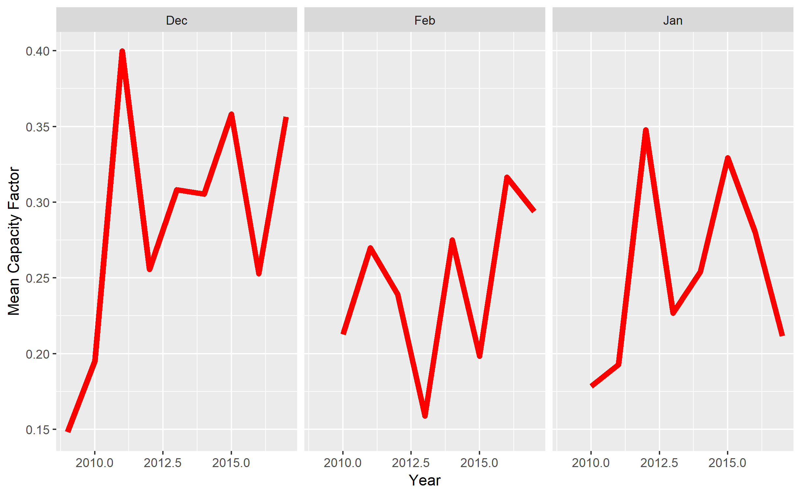

# Wind power anomaly - December 2016

Here we assess, using data from open power system data and from renewables.ninja, if December 2016 had particularly low wind power generation in Europe.

## Getting Started

Clone the repository, and run scripts/wind_generation_anomaly.R 
You may have to define your working directory, if you do not use R-Studio.

### Prerequisites
install.packages(tidyverse)

install.packages(lubridate)

install.packages(sf)

You need an internet connection so the script can download the input data

### Output

The outputs (i.e. figures and csv files) are all collected in directory output/

Some examples:
This map shows  the wind generation anomaly for December 2016 for European countries as derived from renewables.ninja:

This figure shows German capacity factors for December 2009-2017:

## Authors

* **Johannes Schmidt** - *Initial work* 

## License

This project is licensed under the MIT License - see the [LICENSE](LICENSE) file for details
