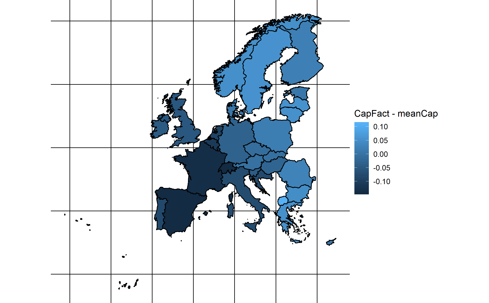

# Wind power anomaly - December 2016

Here we assess, using data from open power system data and from renewables.ninja, if december 2016 had particularly low wind power generation of Europe.

## Getting Started

Clone the repository, and run scripts/wind_generation_anomaly.R 
You may have to define your working directory, if you do not use R-Studio.

### Prerequisites
install.packages(tidyverse)
install.packages(lubridate)
install.packages(sf)

You need an internet connection so the script can download the input data

### Output

The output (i.e. figures and csv files) are all collected in directory output/

e.g. this map showing the wind generation anomaly for december for European countries is produced:

## Authors

* **Johannes Schmidt** - *Initial work* 

## License

This project is licensed under the MIT License - see the [LICENSE.md](LICENSE.md) file for details
